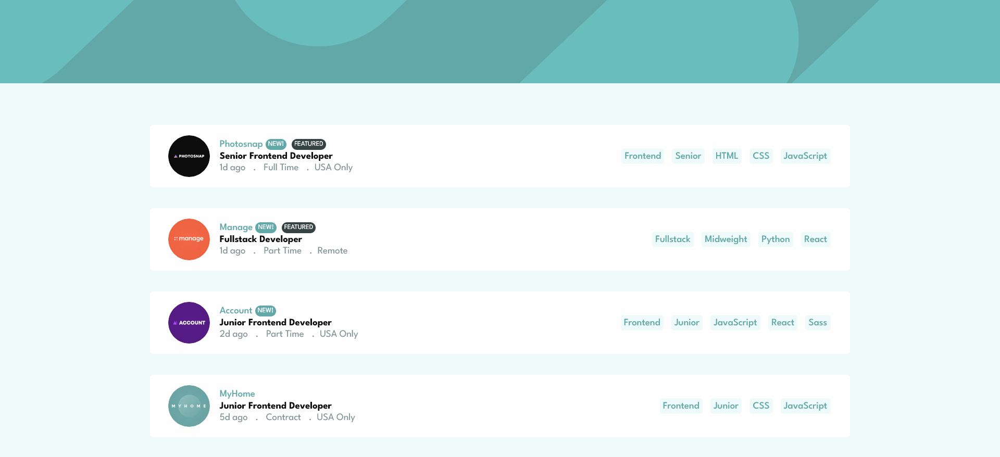

# Frontend Mentor - Job listings with filtering solution

This is a solution to the [Job listings with filtering challenge on Frontend Mentor](https://www.frontendmentor.io/challenges/job-listings-with-filtering-ivstIPCt). Frontend Mentor challenges help you improve your coding skills by building realistic projects. 

## Table of contents

- [Overview](#overview)
  - [The challenge](#the-challenge)
  - [Screenshot](#screenshot)
  - [Links](#links)
- [My process](#my-process)
  - [Built with](#built-with)
- [Author](#author)
- [Acknowledgments](#acknowledgments)

**Note: Delete this note and update the table of contents based on what sections you keep.**

## Overview

### The challenge

Users should be able to:

- View the optimal layout for the site depending on their device's screen size
- See hover states for all interactive elements on the page
- Filter job listings based on the categories

### Screenshot

### Links

- Solution URL: [Add solution URL here](https://your-solution-url.com)
- Live Site URL: [Add live site URL here](https://mk-static-job-listing.netlify.app)

### Built with

- Semantic HTML5 markup
- Sass
- Flexbox
- CSS Grid
- [React](https://reactjs.org/) - JS library

## Author

- Website - [Mtendere Kulemeka](https://www.devmk.netlify.app)
- Frontend Mentor - [@mkulemeka](https://www.frontendmentor.io/profile/mkulemeka)

## Acknowledgments

- Frontend Mentor - [@EmmanuelOluwafemi](https://www.frontendmentor.io/profile/EmmanuelOluwafemi)

